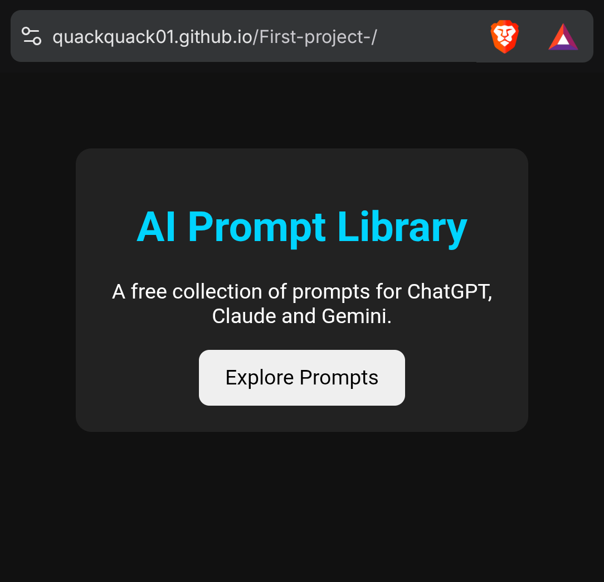

# First-project-

First-project- is an open-source repository created to learn GitHub, practice version control, and build useful software projects. This repository will gradually include sample code, documentation, and experiments that help developers and beginners understand modern development workflows.

## Goals
- Learn Git and GitHub
- Build open-source projects
- Share reusable code
- Welcome community contributions

## Features
- Simple and beginner-friendly
- Open source
- Regular updates
- Well-documented code

## Contributing
Contributions, suggestions, and bug reports are welcome. Feel free to fork the repository, open issues, and submit pull requests.

## License
This project is licensed under the MIT License.

## Roadmap

- Add 100+ AI prompts
- Organize prompts by category
- Improve documentation
- Accept community contributions
- Launch version 1.0

## 🌐 Live Demo

Visit the project here:

https://quackquack01.github.io/First-project-/

## 📸 Project Screenshot

## ✨ Features

- 🤖 AI prompts for ChatGPT
- 🧠 AI prompts for Claude
- 💎 AI prompts for Gemini
- 📖 Beginner-friendly documentation
- 🌍 Open-source project
- 📱 Responsive website

## 🚀 Future Plans

- Add 1000+ AI prompts
- Organize prompts by category
- Add search functionality
- Add copy-to-clipboard buttons
- Support more AI models
- Welcome community contributions

## 👨‍💻 Author

Created and maintained by **Quackquack01**.

⭐ If you like this project, consider starring the repository!